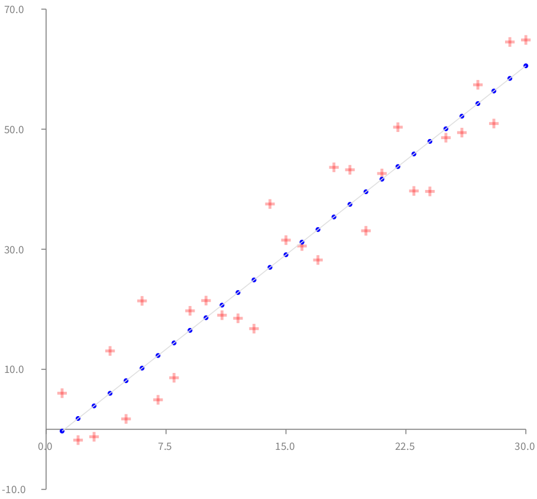

# LinearRegressionVis
Visualizing 30 data points with [Roassal2](http://agilevisualization.com) and fitting them with [PMLinearRegression](https://github.com/PolyMathOrg/PolyMath).

```Smalltalk
model := PMLinearRegression new.
n := 30.
rand := Random new.
points := (1 to: n) collect: [ :x | x@(2 * x + (rand next * 20 - 10)) ].
points do: [ :p | 
  model add: p ].
```


